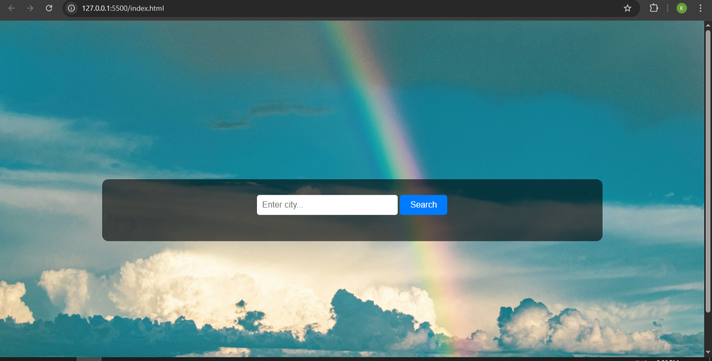
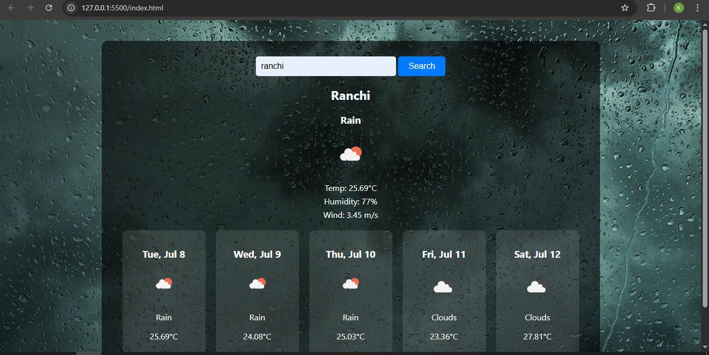
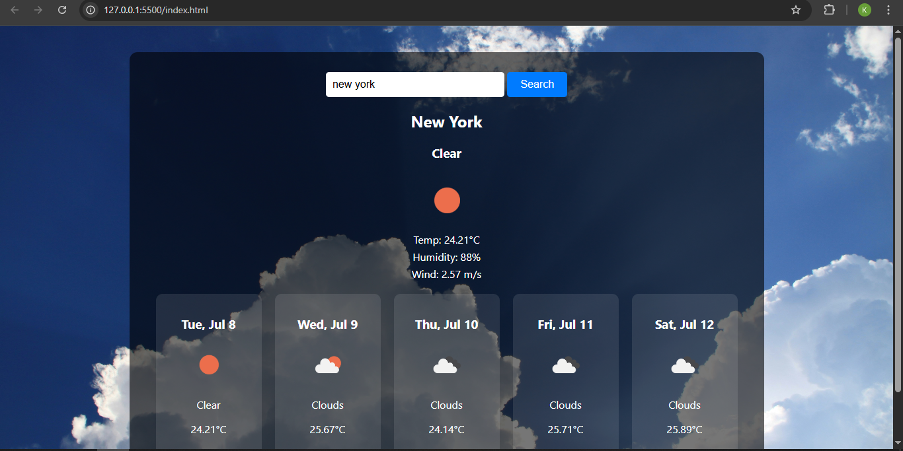
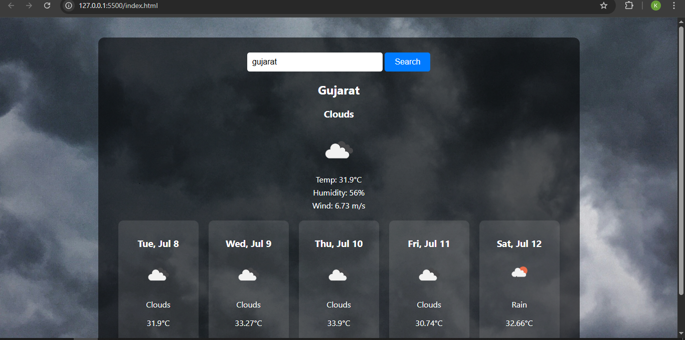

# 🌦️ 7-Day Weather Forecast Web App

```bash

"COMPANY" : CODTECH IT SOLUTIONS
"NAME" : KASHISH KUMARI
"INTERN ID" : CT06DF642
"DOMAIN" : MERN STACK WEB DEVELOPMENT
"DURATION" : 6 WEEKS
"MENTOR" : Neela Santhosh
```


This is a responsive and beautiful weather forecast web application built using **HTML**, **CSS**, and **JavaScript**. It provides detailed **current weather** and a **7-day forecast** using the OpenWeatherMap API. The app also displays **dynamic background images** based on current weather conditions.

---

## 🚀 Features

- 🌐 Get weather for any city in India or worldwide  
- 📍 Optional: Detects your current location using Geolocation API  
- 📅 Shows current weather + 5-day forecast (next 12PM each day)  
- 🎨 Background images change according to weather (rainy, sunny, fog, etc.)  
- 📸 Uses high-quality images or local background files  
- 🧠 Auto-corrects city spelling using Geo API  
- ✅ Clean UI and responsive layout

---

## 🛠️ Tech Stack

- **HTML** – Structure  
- **CSS** – Styling and layout  
- **JavaScript (Vanilla)** – API integration, DOM updates  
- **OpenWeatherMap API** – Weather and geolocation data  
- **Unsplash or Local Images** – Backgrounds  

---

## 📁 Folder Structure

weather-app/
├── index.html
├── style.css
├── script.js
└── backgrounds/
├── sunny.jpg
├── rain.jpg
├── clouds.jpg
├── snow.jpg
└── default.jpg

---

## 🔑 How to Use

1. . **Clone the Repository:**
```bash
git clone https://github.com/kashish-kumari-05/Weather-Application.git
cd Realtime-Chat-App
```
2. Replace the value of `apiKey` in `script.js` with your [OpenWeatherMap API key](https://openweathermap.org/api)  
3. Open `index.html` in a browser or run using Live Server in VS Code  
4. Type a city (e.g., `Delhi`, `Mumbai`, `Bhubaneswar`) and hit **Search**  
5. Optional: Click “Use My Location” to auto-detect your city 🌍

---

## ✅ Example Cities (India)

- Delhi  
- Mumbai  
- Bengaluru  
- Kolkata  
- Hyderabad  
- Bhubaneswar  
- Jaipur  
- Lucknow  
- Ahmedabad  
- Chennai

---

## 📸 Screenshots

### 🔍 Home Page


### 🌦️ Weather Result for Ranchi


### 📱 🌦️ Weather Result for New York


### 📱 🌦️ Weather Result for Gujarat

---

## 💡 Future Improvements (Ideas)

- Add light/dark theme toggle 🌙  
- Add pie charts or graphs for temperature trends 📈  
- Show sunrise/sunset, pressure, visibility  
- Save favorite cities 🔖  
- Add animations or weather effects ❄️ 🌧️ ☀️

---

## 📄 License

This project is open-source and free to use under the MIT License.
